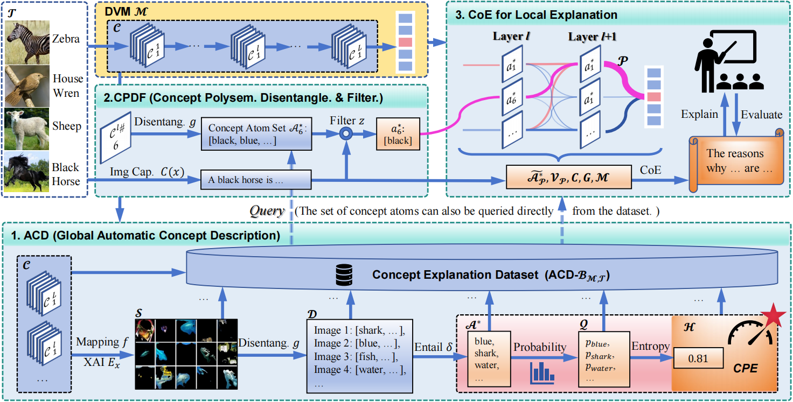

# [***CoE (Chain-of-Explanation)***](https://arxiv.org/pdf/2503.15234) (***<u>CoE: Chain-of-Explanation via Automatic Visual Concept Circuit Description and Polysemanticity Quantification</u>***)

[***CoE (Chain-of-Explanation)***](https://arxiv.org/pdf/2503.15234) (Published in ***<u>CVPR 2025</u>***) is a versatile concept based deep model explainer that establishes a systematical explanation framework from both global and local perspectives. It tackles the challenges of the inflexibility to automatically construct concept explanation datasets, insufficient linguistic explanations, and the weakness in managing concept polysemanticity of concept-based XAI methods.

* CoE automatically and systematically provides concept-based glocal explanations, along with managing the problem of polysemanticity, in a more interpretable natural language format. It decodes and description of concepts via LVLMs and constructs global concept explanation datasets. CoE also enables local explanations of model’s decision-making process, represented through natural language. 
* ***CPDF (Concept Polysemanticity Disentanglement and Filtering)*** mechanism handles the hard-to-interpret polysemantic concepts. To our knowledge, CPDF is a pioneer tailored to comprehensively disentangle and quantify polysemanticity. It disentangles them into a set of succinct concept atoms, followed by a filtering function to contextually find the most contextually relevant atom as the explanation node, advancing the modeling of deterministic concepts to uncertain concept atom distributions. 
* ***CPE (Concept Polysemanticity Entropy)*** score is defined to quantify the polysemanticity of concepts, which can be utilized as a metric of the interpretability of concepts or models.
* ***Three explainability evaluation metrics*** for automatically evaluating the language based explanations are designed. Both GPT-4o and human-based experiments validate the superiority of the CoE in automatically constructing global and local explanations and the effectiveness of CPE in quantifying concept polysemanticity.

<div align=center>

<br>    
The overall framework of CoE.
</div> 

# :hammer_and_wrench: Getting Started

### :computer: Environmental Requirement:

- Python 3.9 (3.8 is also tested ok)
- PyTorch 2.1 (1.13.1 is also tested ok)
- The current code uses an internvl-8B model, and it is necessary to have a machine with a 3090 GPU or higher specifications.
- CoE will generate some visual concepts (images), so there are requirements for the storage capacity of your device (e.g., 9G for ResNet152 explaining 4 layers ( Output layer of Stage 1,2,3,4) and Imagenet-val dataset).

```
pip install -r requirements.txt
```

### :computer: Running Steps:

1.  Put the deep model you want to explain into a folder (e.g., ./output/dvm1/xxx.pth);

   ***Key Note: The models currently supported and explained by CoE include: CNN, ViT, CLIP.***

2.  Put the dataset utilized for constructing concepts into a folder (e.g., ./dataset/imagenet/val);

3.  Download LVLMs or LLMs you want to use for describing the concepts;

   e.g., For entailment model:

   `Download  microsoft/deberta-v2-xlarge-mnli and put it into./model/microsoft/deberta-v2-xlarge-mnli/`

   e.g., For image captioning:

   `Download OpenGVLab/InternVL2-8B and put it into./model/OpenGVLab/InternVL2-8B/`

   **<u>*Note:*</u>  Many components in the CoE can be replaced. You can use an offline large model or call an API. If you have more GPU resources available, you can use a larger model, which will yield better results.**

   ***You need to set the API information if you want to use it.***

4. Set the LVLMs and LLMs you want to use in every steps of CoE (Set the according args in ***parser.py***);

5. Give an image you want to explain the decision process of the model (i.e., args.imgviz);

6. Set the XAI method for decoding visual concepts (e.g., CRP);

7. Set the model you want to explain (i.e., args.resume in parser.py)(e.g., args.resume='resnet152')

8. Define the layers you want to decodes visual concepts (e.g., Layer4 in ResNet152)

9. Run

   `python main.py --dataset imagenet-val --resume rn152`

   **Other parameters should be set in *parser.py*.**

   Then, CoE will generate a global concept explanation dataset as described in the main paper and provide a local language explanation of the model's decision for the given sample. 

10.  Then, CoE will generate visual concepts, decoupled concept atoms, probabilities, entropy, and local natural language explanations. All results containing global (concept atoms, probability, entropy .etc) and local explanations will be output to ./output/dvm1/

11. You can use CoE-eval.py for evaluating the language explanations automatically.

 **Note: The author has provided explanations for all the key steps in the code. All of the key steps in our code have the function of resuming from where they were interrupted.**


## :book: Citation

If you find this work useful for your research, please cite our github repo:

```bibtex
@inproceedings{Yu_cvpr2025_CoE,
  title={CoE: Chain-of-Explanation via Automatic Visual Concept Circuit Description and Polysemanticity Quantification},
  author={Yu, Wenlong and Wang, Qilong and Liu, Chuang and Li, Dong and Hu, Qinghua},
  booktitle={Proceedings of the Computer Vision and Pattern Recognition Conference},
  pages={4364--4374},
  year={2025}
}
```

## Acknowledgements

The project is based on [CRP](https://github.com/rachtibat/zennit-crp), [Caption-Anything](https://github.com/ttengwang/Caption-Anything), [ChatGPT](https://openai.com/blog/chatgpt), [semantic_uncertainty](https://github.com/jlko/semantic_uncertainty), [InternVL](https://github.com/OpenGVLab/InternVL). Thanks for the authors for their efforts.
